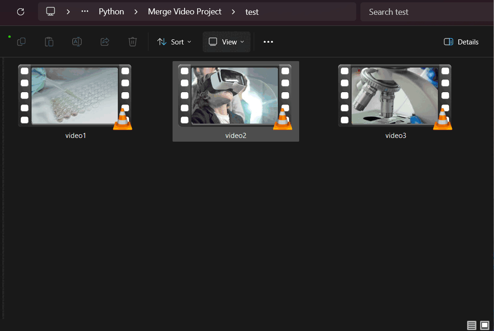

# About the Project
 
> [!IMPORTANT]  
> The Project is in its version. And more Features will be added.

This is a Personal Project to Concatenate multiple video with help of a GUI interface. Before each video you can add a video clip(No Audio), On its center have the video name of the Upcoming video. And it's also provide a text file containing the timestamp of each video and its corresponding name. 

The order of Concatenation will decide based on the first character of the Video file.

> [!NOTE]  
> If first character is same, then based on second character and so on.


# Installation

> [!NOTE] 
> Python == 3.11.4 (Recommended)

```
git clone https://github.com/amitkr000/Merge-Video-Project.git

cd Merge-Video-Project

pip install -r requirement.txt
```

# Demo



